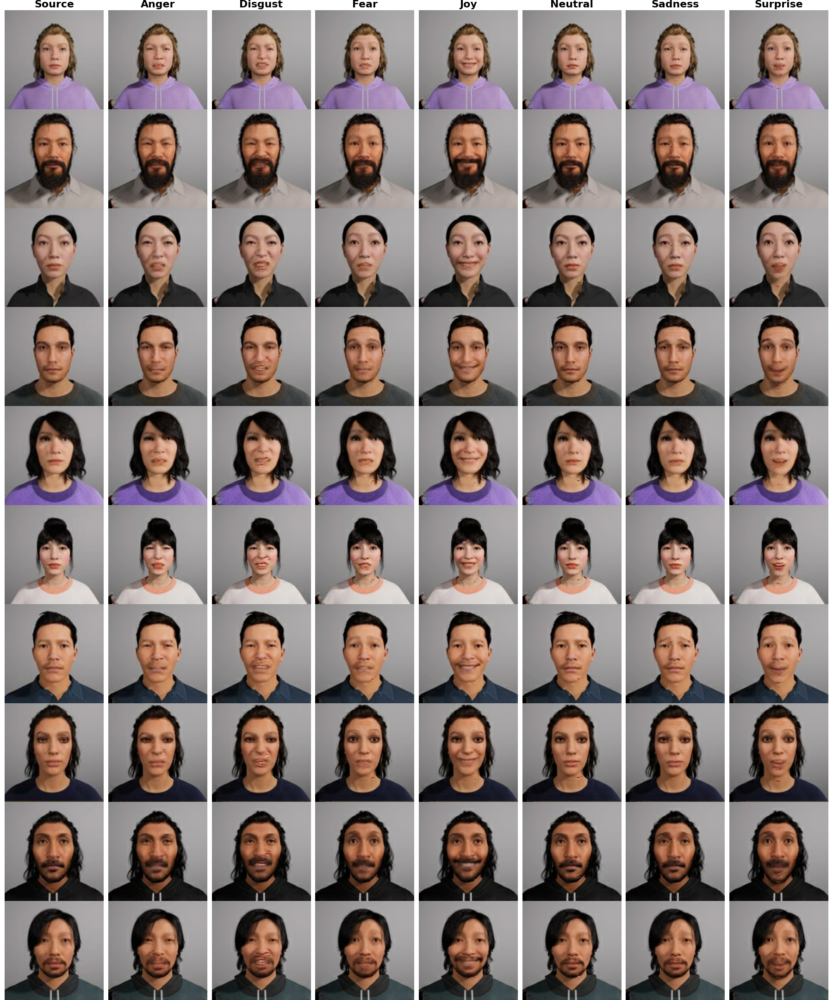

# FExGAN-Meta: Facial Expression Generation with Meta-Humans


This is the demo of the FExGAN-Meta proposed in the following article:

[FExGAN-Meta: Facial Expression Generation with Meta-Humans](https://osf.io/ygdrt)

FExGAN-Meta is the extension of [FExGAN](https://arxiv.org/abs/2201.09061v2). It takes input an image of Meta-Human and a vector of desired affect (e.g. angry,disgust,sad,surprise,joy,neutral and fear) and converts the input image to the desired emotion while keeping the identity of the original image.



# Requirements

In order to run this you need following:

* Python >= 3.7
* Tensorflow >= 2.6
* CUDA enabled GPU with memory >=8GB (e.g. GTX1070/GTX1080)


# Usage

You can either run this on google colab or run it on your local system

* Install the pre-requisites
* Download the models (if any link fails in the notebook due to google drive restriction, try downloading them manually)
* Execute the rest of the notebook

# Dataset

https://huggingface.co/datasets/azad-wolf-se/MH-FED

# Citation

If you use any part of this code or use ideas mentioned in the paper, please cite the following article.

```
@article{Siddiqui_FExGAN-Meta_2022,
  author = {{Siddiqui}, J. Rafid},
  title = {{FExGAN-Meta: Facial Expression Generation with Meta-Humans}},
  keywords = {Deep Learning, GAN, Facial Expressions},
  year = {2022}
  DOI: 10.31219/osf.io/ygdrt
  url = {https://osf.io/ygdrt}
}

```
